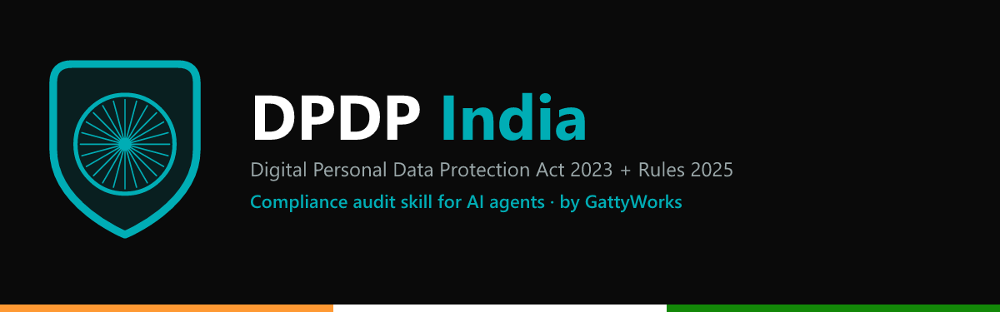

<p align="center">
  <picture>
    <source media="(prefers-color-scheme: dark)" srcset="assets/banner-dark.png">
    <source media="(prefers-color-scheme: light)" srcset="assets/banner-light.png">
    
  </picture>
</p>

<p align="center">
  <a href="LICENSE"></a>
  
  
  
</p>

<h3 align="center">Point an AI agent at your build and ask: <i>"are we breaking any Indian data-protection rules?"</i></h3>

A self-contained **skill** that audits an application, codebase, product, or data flow against
**India's Digital Personal Data Protection Act, 2023** and the **DPDP Rules, 2025** (notified
13 Nov 2025). It ships the statutory text, the penalty schedule, a section-by-section audit
checklist, codebase detection patterns, a GDPR↔DPDP map, and ready-reference policy templates —
so the agent cites real sections and points every gap at the fix.

> 🇮🇳 The first in a planned family of country-by-country compliance skills. **This repo is India.**

## What it checks

Lawful basis & consent (§4–7) · notice quality · **reasonable security safeguards** (§8(5) — the
₹250 crore band) · breach notification (Board within 72h, principals without delay) · **children's
data** (§9, under-18) · Data Principal rights (§11–14) · retention & erasure (3-year inactivity
class) · cross-border transfer (§16) · Significant Data Fiduciary duties (§10) · processor/DPA
coverage · published privacy artifacts.

Each finding comes back with a **status**, **severity mapped to penalty exposure**, real
`file:line` **evidence**, a **remediation**, and the **template** that closes it.

## Install (Claude Code)

```bash
/plugin marketplace add gattyworks/dpdp-india
/plugin install dpdp-india@gattyworks-compliance
```

Then run a scan:

```bash
/dpdp-audit .            # audit the current repo
/dpdp-audit ./api        # audit a subtree
```

…or just say *"audit this app for DPDP / Indian data-protection compliance."*

### Use it in any AI harness

The skill is a plain, portable **`SKILL.md` + references** bundle — no runtime, no secrets. Drop
[`plugins/dpdp-india/skills/dpdp-india/`](plugins/dpdp-india/skills/dpdp-india/) into any
agent that reads skills/markdown context (Cursor, Windsurf, the Claude Agent SDK, your own RAG),
or simply tell the model: *"read SKILL.md and audit this codebase against it."* Everything it needs
is in the folder.

## Keeping current

The law commences in phases, so sources move. A zero-dependency checker re-fetches every pinned
source and flags drift:

```bash
python plugins/dpdp-india/scripts/check-updates.py      # also: check-updates.ps1 / .sh
/dpdp-update-check                                       # the same, from Claude Code
```

It hashes the [pinned sources](plugins/dpdp-india/scripts/sources.lock.json) (MeitY Act PDF,
DPDP Rules, dpdpa.com, dpdpa.in, the GDPR-comparison PDF) and tells you which reference files to
re-verify. Run with `--update` to re-pin after you've refreshed the references.

## What's inside

```
.
├── .claude-plugin/marketplace.json        # marketplace (gattyworks-compliance)
├── assets/                                 # banner + logo (Ashoka Chakra · GattyWorks teal · tricolor)
└── plugins/dpdp-india/
    ├── .claude-plugin/plugin.json
    ├── commands/                           # /dpdp-audit, /dpdp-update-check
    ├── scripts/                            # check-updates.{py,ps1,sh} + sources.lock.json
    └── skills/dpdp-india/
        ├── SKILL.md                        # the audit playbook (start here)
        └── references/
            ├── audit-checklist.md          # the section-by-section engine
            ├── code-patterns.md            # what to grep for in a codebase
            ├── act-2023.md · rules-2025.md · penalties-schedule.md
            ├── consent-notice.md · fiduciary-obligations.md · data-principal-rights.md
            ├── gdpr-comparison.md · legal-context.md · disclaimer.md
            └── templates/                  # 13 policy artifacts a compliant build needs
```

## A family, not a one-off

The vision is one focused skill per jurisdiction — `dpdp-india` here, with room for GDPR, CCPA,
and others as sibling repos under the same `gattyworks-compliance` marketplace. India first
because the DPDP regime is new, fast-moving, and under-tooled.

## Sources

Built from primary text: the [DPDP Act 2023 (MeitY gazette)](https://www.meity.gov.in/static/uploads/2024/06/2bf1f0e9f04e6fb4f8fef35e82c42aa5.pdf),
the DPDP Rules 2025, the knowledge hub at [dpdpa.com](https://www.dpdpa.com/) /
[dpdpa.in](https://www.dpdpa.in/), and Latham & Watkins' DPDP-vs-GDPR comparison. Statutory text
is government work; third-party template structures are paraphrased and attributed, not mirrored.

## Contributing & community

<p align="center">
  <a href="CONTRIBUTING.md"></a>
  <a href="CODE_OF_CONDUCT.md"></a>
  <a href="SECURITY.md"></a>
</p>

Corrections to the legal references are especially welcome — cite the section/rule and the source.
We work in short-lived branches and ship through review; never push straight to `main`.

## License

[MIT](LICENSE) © 2026 GattyWorks.

---

<p align="center">
  <sub>Built by <b>GattyWorks</b> · <a href="https://gattyworks.com">gattyworks.com</a> · hello@gattyworks.com · Mangaluru &amp; Bengaluru, India 🇮🇳</sub>
</p>

<p align="center">
  <sub>This skill is an engineering aid for spotting likely gaps — <b>not legal advice</b>, and no
  lawyer–client relationship is created. The law changes; references reflect the verified date above.
  Always run your own audit and have a qualified Indian data-protection practitioner review before you
  rely on any result. Provided "as is"; see <a href="plugins/dpdp-india/skills/dpdp-india/references/disclaimer.md">disclaimer</a>.</sub>
</p>
