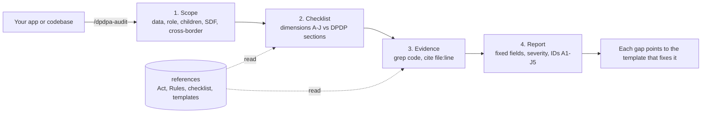

<p align="center">
  <a href="LICENSE"></a>
  
  
  
</p>

<p align="center"><i>A <a href="https://github.com/gattyworks">GattyWorks</a> project.</i></p>

<h3 align="center">Point an AI agent at your build and ask: <i>"are we breaking any Indian data-protection rules?"</i></h3>

An open-source GattyWorks **skill** that audits an application, codebase, product, or data flow against
**India's Digital Personal Data Protection Act, 2023** and the **DPDP Rules, 2025** (notified
13 Nov 2025, corrected in December 2025). It has 49 checks across 10 dimensions, codebase detection
patterns, a fixed report contract, a GDPR comparison, and 13 policy-artifact specifications.

**Naming.** "DPDP Act" and "DPDPA" are the same law: the **Digital Personal Data Protection Act, 2023**.
This project uses DPDPA; the legal references use the official short forms "DPDP Act" and "DPDP Rules".
Primary source: [DPDP Act 2023, MeitY gazette](https://www.meity.gov.in/static/uploads/2024/06/2bf1f0e9f04e6fb4f8fef35e82c42aa5.pdf).

> **Current phase:** Most product-facing duties are notified but are not yet in force as of
> 2026-08-15. The audit now separates current gaps from readiness gaps. See
> [`rules-2025.md`](plugins/dpdpa-india/skills/dpdpa-india/references/rules-2025.md).

## What it checks

Lawful basis & consent (4-7), notice quality, **reasonable security safeguards** (8(5) - the
₹250 crore band), breach notification (Board within 72h, principals without delay), **children's
data** (9, under-18), Data Principal rights (11-14), retention and erasure (including the
Third-Schedule inactivity rule for specified large platforms), cross-border transfer (16), Significant Data Fiduciary duties (10), processor/DPA
coverage, published privacy artifacts.

Each finding comes back with a **status**, **severity mapped to penalty exposure**, real
`file:line` **evidence**, a **remediation**, and the **template** that closes it.

## How it works



- **Scope** the personal-data surface and whether the org is a Data Fiduciary or Processor.
- **Run the checklist** dimension by dimension, each item mapped to a DPDP section or rule.
- **Gather evidence** from the code (`file:line`); never assert a gap you have not looked for.
- **Report** to the fixed [contract](plugins/dpdpa-india/skills/dpdpa-india/references/report-format.md) so every run returns the same fields, severities, and issue IDs.

## Example audit report

Every audit returns the **same structure, fields, severity levels, and issue IDs**, so results are
consistent and comparable from one run to the next. The full output contract and a complete worked
example live in [`report-format.md`](plugins/dpdpa-india/skills/dpdpa-india/references/report-format.md).

- **Severity:** `Critical` (fix first; biggest fines or harm to people), `High`, `Medium`, `Low`.
- **Statuses:** ✅ Compliant, ⚠️ Gap, ~ Readiness gap, ❓ Needs review, ➖ N/A.
- **Finding fields:** ID, Requirement (section/rule cite), Status, Severity, Evidence (`file:line`), Fix.
- **Issue IDs:** every finding maps to a fixed catalog ID (`A1` ... `J5`) from the checklist, so two audits of the same system line up exactly.

A trimmed sample:

```
DPDPA Audit - Acme Shop (Next.js + Postgres)     Verdict: Readiness gaps found
Audit date: 2026-08-15 | Mode: Readiness
Scope: Fiduciary | Children: unknown | SDF: no | Cross-border: yes

| ID | Requirement (cite)                  | Status       | Severity | Evidence          | Fix |
|----|-------------------------------------|--------------|----------|-------------------|-----|
| C1 | Security safeguards (8(5), Rule 6) | ~ Readiness gap | Critical | api/db.ts:14      | Enforce TLS, vault secrets, encrypt at rest |
| E3 | No tracking of children (9(3))     | ~ Readiness gap | Critical | app/layout.tsx:22 | Gate analytics/ads off for under-18 |
| F1 | Right to access (11)               | ~ Readiness gap | High     | not found         | Add an access-request flow |
| A1 | Lawful basis (4)                   | ✅ Compliant | High     | server/auth.ts:30 | - |
| G1 | India-based DPO (10(2))            | ➖ N/A       | -        | -                 | Below SDF threshold; revisit at scale |
```

Each gap is explained in plain language so a non-lawyer can act on it - what it is, the fix, and what happens if you do not fix it:

> **C1 - Security safeguards (Critical)**
> - What it is: the app talks to its database without encryption and a secret key is committed to the repo.
> - Fix: enforce TLS, move the key to a secrets vault, and encrypt data at rest.
> - If unfixed: a breach here can draw a penalty of up to ₹250 crore (the Act's highest band), plus leaked customer data and reputational damage.

The report also includes a risk summary, the top 3 risks, what to confirm with counsel or ops, and the disclaimer.

## Install

### Claude Code

Add the public Claude Code marketplace, then install the plugin:

```bash
/plugin marketplace add gattyworks/india-dpdpa-skill
/plugin install dpdpa-india@gattyworks-compliance
```

Then run a scan:

```bash
/dpdpa-audit .            # audit the current repo
/dpdpa-audit ./api        # audit a subtree
```

Or say *"audit this app for DPDP or Indian data-protection compliance."*

### Codex and ChatGPT

Ask `$skill-installer` to install the skill from this public folder:

```text
https://github.com/gattyworks/india-dpdpa-skill/tree/main/plugins/dpdpa-india/skills/dpdpa-india
```

Codex also discovers the repository entry point at
[`/.agents/skills/dpdpa-india/SKILL.md`](.agents/skills/dpdpa-india/SKILL.md) when you clone this
repository. The installed skill includes its Codex metadata, references, source checker, and
Saakshi icon.

### Hermes Agent

Install the same Agent Skills bundle directly from GitHub:

```bash
hermes skills install gattyworks/india-dpdpa-skill/plugins/dpdpa-india/skills/dpdpa-india
```

Start a new Hermes session. Use `/dpdpa-india` or ask for an Indian data-protection audit.

### Example prompts (after install)

Once installed, point the agent at your code with prompts like:

- *"Use the dpdpa-india skill to audit this repo for DPDP compliance and list the top risks."*
- *"Run /dpdpa-audit on ./api and return findings as a table with section, status, and severity."*
- *"Check our signup and analytics flow against India's DPDP Act. Are we handling children's data correctly?"*
- *"Are we a Significant Data Fiduciary, and what would that require of us?"*
- *"Which privacy policies and templates do we need for Indian users, and which are missing here?"*

### One playbook for every harness

Claude Code, Codex, ChatGPT, and Hermes Agent load the same canonical playbook at
[`plugins/dpdpa-india/skills/dpdpa-india/SKILL.md`](plugins/dpdpa-india/skills/dpdpa-india/SKILL.md)
and its bundled files. Host-specific entry points only handle discovery and invocation. They do
not copy or change the legal rules, checklist IDs, or report contract.

## Keeping current

The law commences in phases, so sources move. A zero-dependency checker re-fetches every pinned
source and flags drift:

```bash
python plugins/dpdpa-india/skills/dpdpa-india/scripts/check-updates.py
/dpdpa-update-check                                       # the same, from Claude Code
```

It checks the [pinned sources](plugins/dpdpa-india/skills/dpdpa-india/scripts/sources.lock.json), including the Act,
final Rules, corrigendum, commencement notice, Board notices, and secondary reference sources.
Stable files use SHA-256. Four secondary HTML pages sit behind a JavaScript challenge, so
automation checks that they remain reachable and maintainers review the rendered pages.
It detects changes to known URLs. It cannot discover a new notification at a new URL, so the
official MeitY DPDP Rules page still needs a manual monthly check.

## What's inside

```
.
├── .agents/skills/dpdpa-india/              # Codex repository entry point
├── .claude-plugin/marketplace.json        # marketplace (gattyworks-compliance)
├── design/                                 # source banner and mascot artwork
└── plugins/dpdpa-india/
    ├── .claude-plugin/plugin.json
    ├── commands/                           # /dpdpa-audit, /dpdpa-update-check
    └── skills/dpdpa-india/
        ├── SKILL.md                        # the audit playbook (start here)
        ├── agents/openai.yaml              # Codex and ChatGPT metadata
        ├── assets/saakshi.svg              # skill icon
        ├── scripts/                        # source checker and source lock
        └── references/
            ├── audit-checklist.md          # the section-by-section engine
            ├── code-patterns.md            # what to grep for in a codebase
            ├── act-2023.md, rules-2025.md, penalties-schedule.md
            ├── consent-notice.md, fiduciary-obligations.md, data-principal-rights.md
            ├── gdpr-comparison.md, legal-context.md, disclaimer.md
            └── templates/                  # 13 policy artifacts a compliant build needs
```

## Product direction

This repository is the public source for GattyWorks DPDPA audits. The landing page explains the
workflow and gives teams a way to request a human-led project audit.

## Sources

The primary legal baseline is the [DPDP Act 2023](https://www.meity.gov.in/static/uploads/2024/06/2bf1f0e9f04e6fb4f8fef35e82c42aa5.pdf),
[final DPDP Rules 2025](https://www.meity.gov.in/static/uploads/2025/11/53450e6e5dc0bfa85ebd78686cadad39.pdf),
[corrigendum](https://www.meity.gov.in/static/uploads/2025/12/3c7ebbae0e5456f493f486e6845df86b.pdf),
and [commencement notification](https://www.meity.gov.in/static/uploads/2025/11/c56ceae6c383460ca69577428d36828b.pdf).
Third-party template structures are paraphrased and attributed, not mirrored.

## License and maintenance

- **License:** [MIT](LICENSE) © 2026 GattyWorks.
- **Access:** the repository is public and maintained by GattyWorks.
- **Changes:** [CONTRIBUTING.md](CONTRIBUTING.md) defines the review process.
- **Code of conduct:** [CODE_OF_CONDUCT.md](CODE_OF_CONDUCT.md).
- **Security:** use the private reporting channels in [SECURITY.md](SECURITY.md).

We work in short-lived branches and ship through review; never push straight to `main`.

A [GattyWorks](https://github.com/gattyworks) project.

---

<p align="center">
  <sub>Built by <b>GattyWorks</b>, <a href="https://gattyworks.com">gattyworks.com</a>, hello@gattyworks.com, Mangaluru &amp; Bengaluru, India</sub>
</p>

<p align="center">
  <sub>This skill is an engineering aid for spotting likely gaps - <b>not legal advice</b>, and no
  lawyer-client relationship is created. The law changes; references reflect their dated source headers.
  Always run your own audit and have a qualified Indian data-protection practitioner review before you
  rely on any result. Provided "as is"; see <a href="plugins/dpdpa-india/skills/dpdpa-india/references/disclaimer.md">disclaimer</a>.</sub>
</p>
