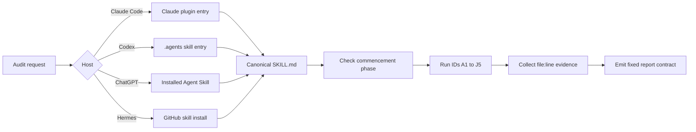

# Architecture

`dpdpa-india` has one canonical Agent Skills bundle. Claude Code loads it as a plugin. Codex and
ChatGPT load it as a skill. Hermes Agent installs the same folder from GitHub. Every path uses the
same references and report contract.

This is an engineering aid, not legal advice.

## Directory tree

```text
dpdp-india/
|-- .agents/skills/dpdpa-india/
|   `-- SKILL.md                         # Codex entry point
|-- .claude-plugin/
|   `-- marketplace.json                # public Claude marketplace manifest
|-- plugins/dpdpa-india/
|   |-- .claude-plugin/plugin.json      # Claude plugin manifest
|   |-- commands/
|   |   |-- dpdpa-audit.md
|   |   `-- dpdpa-update-check.md
|   `-- skills/dpdpa-india/
|       |-- SKILL.md                    # canonical playbook
|       |-- agents/openai.yaml          # Codex and ChatGPT metadata
|       |-- assets/saakshi.svg          # skill icon
|       |-- scripts/                    # source checker and source lock
|       `-- references/
|           |-- audit-checklist.md      # 49 checks, IDs A1 to J5
|           |-- report-format.md        # fixed output contract
|           |-- code-patterns.md        # repository evidence searches
|           |-- act-2023.md
|           |-- rules-2025.md
|           |-- penalties-schedule.md
|           |-- consent-notice.md
|           |-- fiduciary-obligations.md
|           |-- data-principal-rights.md
|           |-- gdpr-comparison.md
|           |-- legal-context.md
|           |-- disclaimer.md
|           `-- templates/              # 13 policy-artifact specifications
|-- design/                             # banner and mascot source files
|-- docs/
|-- dpdpa-guide/                        # short entry guide, not a second legal corpus
`-- README.md
```

## Canonical playbook

The canonical file is
[`plugins/dpdpa-india/skills/dpdpa-india/SKILL.md`](../plugins/dpdpa-india/skills/dpdpa-india/SKILL.md).
It defines when to run the skill, the four audit passes, the phase check, the report contract, and
the reference map.

The Codex file at
[`/.agents/skills/dpdpa-india/SKILL.md`](../.agents/skills/dpdpa-india/SKILL.md) is a small
dispatcher. It tells Codex to read the canonical playbook completely. It does not copy legal text.

The Claude plugin loads the same canonical file from its `skills/` directory. Its two commands are
thin entry points:

- `/dpdpa-audit` selects a target and runs the four passes.
- `/dpdpa-update-check` runs the source checker.

Hermes installs the canonical folder directly. Its `/dpdpa-india` command loads the same
`SKILL.md`, references, and scripts. No Hermes-specific legal copy exists.

## Audit flow



## Progressive disclosure

The host loads `SKILL.md` first. The playbook then routes each need to one reference file. For
example, it reads `audit-checklist.md` for the 49 controls and `code-patterns.md` for repository
searches. It reads a template specification only when a finding needs that artifact.

This keeps the initial context small. It also makes source ownership clear. The old
`dpdpa-guide/` now points back to the canonical playbook instead of maintaining a second set of
legal instructions.

## Source-currentness layer

`sources.lock.json` pins known source URLs. Stable files use SHA-256. Four secondary HTML pages sit
behind a JavaScript challenge, so automation checks reachability and maintainers review the rendered pages. The Python checker
is canonical. PowerShell and shell variants support hosts without the same runtime.

Exit codes are stable:

| Code | Meaning |
|---|---|
| 0 | All sources match, or a requested update completed |
| 1 | One or more known sources changed |
| 2 | The check is incomplete because one or more sources failed |

The checker refuses a partial update. It detects byte changes in stable files and unreachable
secondary pages. It cannot discover a new government notification at a new
URL, so the monthly runbook includes a manual review of the
official MeitY DPDP Rules page.

## Access and portability

The repository, install steps, method, and audit references are public under the MIT license.

The canonical skill is a self-contained Agent Skills folder. It includes its references, scripts,
Codex metadata, and icon. The host still controls where code and prompts are processed. Do not
claim an audit stays on-device unless the host guarantees that behavior.

## See also

- [Audit method](audit-method.md)
- [Staying current](staying-current.md)
- [Legal and provenance](legal-and-provenance.md)
- [Usage](usage.md)
