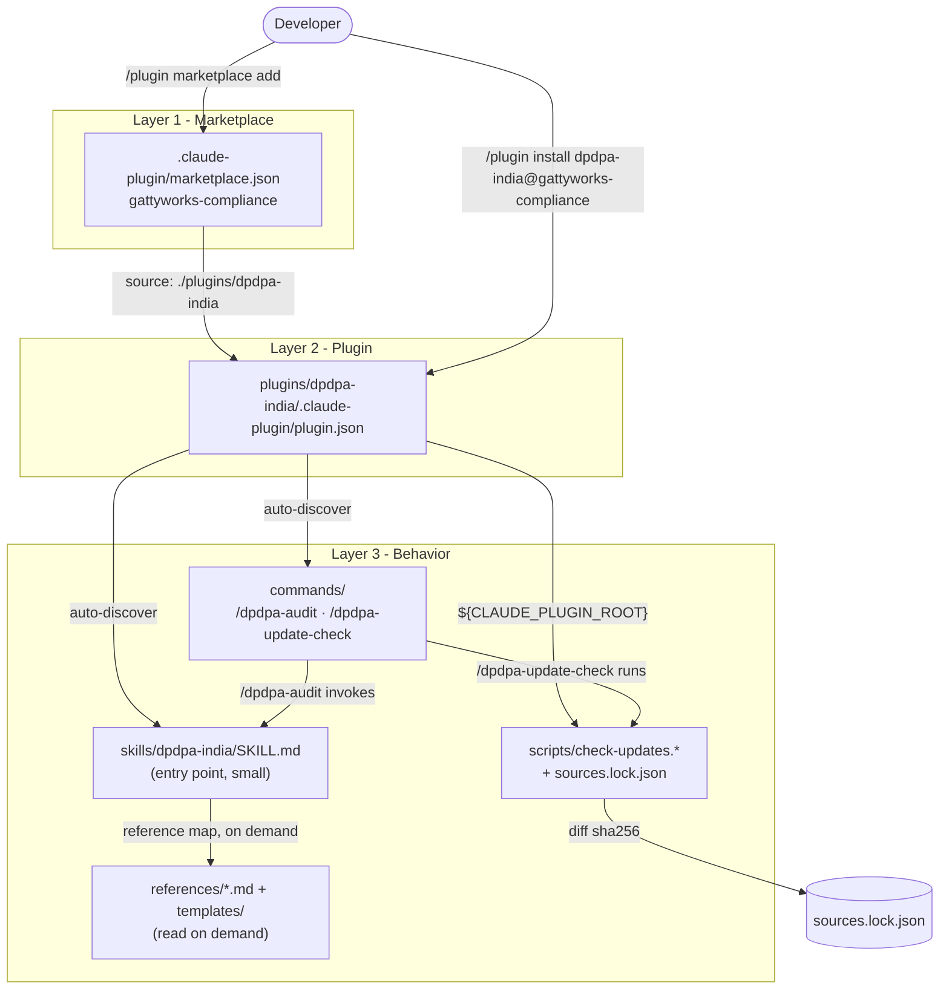

# Architecture

`dpdpa-india` is two things in one tree: a **Claude Code plugin** (installable from a marketplace) and a **portable AI skill** (self-contained markdown that runs in any harness). This page maps the directory layout, the three nested layers that wire it together, how Claude Code discovers and loads it, the progressive-disclosure design that keeps it fast, and why the skill folder is portable on its own.

It is an engineering aid, not legal advice - see [Legal and provenance](legal-and-provenance.md).

## Directory tree

```
dpdpa-india/                                  # repo root
├── .claude-plugin/
│   └── marketplace.json                     # marketplace manifest → lists the plugin, points at ./plugins/dpdpa-india
├── plugins/
│   └── dpdpa-india/                          # the plugin
│       ├── .claude-plugin/
│       │   └── plugin.json                  # plugin manifest (name, description, version, author)
│       ├── README.md                        # plugin-level install/use/layout
│       ├── commands/                         # slash commands (auto-discovered)
│       │   ├── dpdpa-audit.md                # /dpdpa-audit [path] - invokes the skill's 4-pass method
│       │   └── dpdpa-update-check.md         # /dpdpa-update-check - runs the source-drift checker
│       ├── scripts/                          # referenced via ${CLAUDE_PLUGIN_ROOT}
│       │   ├── check-updates.py             # stdlib-only source-hash diff (cross-platform)
│       │   ├── check-updates.ps1            # Windows variant
│       │   ├── check-updates.sh             # macOS/Linux variant
│       │   └── sources.lock.json            # pinned upstream sources + sha256 + verified date
│       └── skills/
│           └── dpdpa-india/                   # the portable skill (self-contained)
│               ├── SKILL.md                  # entry point: when-to-use, 4-pass method, output format, reference map
│               └── references/               # read on demand (progressive disclosure)
│                   ├── act-2023.md           # Act index + definitions (§2)
│                   ├── audit-checklist.md    # section-by-section audit engine (core)
│                   ├── code-patterns.md      # what to grep for in a codebase
│                   ├── consent-notice.md     # consent & notice (§4-7)
│                   ├── fiduciary-obligations.md # fiduciary duties (§8-10, 16)
│                   ├── data-principal-rights.md # rights (§11-15)
│                   ├── penalties-schedule.md  # the Schedule (max ₹250 crore, §8(5))
│                   ├── rules-2025.md          # DPDP Rules 2025 operational detail
│                   ├── gdpr-comparison.md     # GDPR ↔ DPDP gap mapping
│                   ├── legal-context.md       # Puttaswamy / IT Act / CERT-In context
│                   ├── disclaimer.md          # "not legal advice" text
│                   ├── sources/               # archived source artifacts (e.g. lw-dpdp-vs-gdpr.pdf/.txt)
│                   └── templates/             # ready-reference policy artifacts
│                       ├── README.md          # template index
│                       ├── _site-map.md
│                       ├── privacy-policy.md
│                       ├── consent-notice.md
│                       ├── cookie-policy.md
│                       ├── cross-border-transfer-agreement.md
│                       ├── data-breach-response.md
│                       ├── data-processing-agreement.md
│                       ├── data-protection-policy.md
│                       ├── data-retention-policy.md
│                       ├── dpia.md
│                       ├── dsar-request.md
│                       ├── employee-privacy-policy.md
│                       ├── grievance-redressal.md
│                       └── third-party-vendor-agreement.md
├── docs/                                     # this developer documentation
├── assets/                                   # banners, logo, social preview
├── README.md  CHANGELOG.md  CONTRIBUTING.md  CODE_OF_CONDUCT.md  SECURITY.md  LICENSE
└── .gitignore
```

## The three layers

The plugin is a chain of three manifests/folders, each pointing one level down.

| Layer | File / folder | Role |
|-------|---------------|------|
| 1. Marketplace | [`.claude-plugin/marketplace.json`](../.claude-plugin/marketplace.json) | Declares the `gattyworks-compliance` marketplace and its `plugins` array. The `dpdpa-india` entry sets `source: "./plugins/dpdpa-india"`, plus `version`, `description`, and `keywords`. India (DPDP) is first; the marketplace is built to hold more jurisdictions. |
| 2. Plugin | [`plugins/dpdpa-india/.claude-plugin/plugin.json`](../plugins/dpdpa-india/.claude-plugin/plugin.json) | The plugin manifest: `name`, `description`, `version` (1.0.0), `author`, `homepage`, `repository`, `license` (MIT), `keywords`. Its sibling folders - `commands/`, `scripts/`, `skills/` - are conventionally located and auto-discovered. |
| 3. Skill + commands + scripts | `skills/dpdpa-india/`, `commands/`, `scripts/` | The behavior. The **skill** ([`SKILL.md`](../plugins/dpdpa-india/skills/dpdpa-india/SKILL.md) + `references/`) carries the audit method and the law. **Commands** are thin entry points that invoke the skill. **Scripts** keep the pinned sources honest. |

Layer 3 splits by responsibility:

- **Skill** - the playbook. `SKILL.md` is the loaded-first entry point; everything substantive lives behind it in `references/`.
- **Commands** - `dpdpa-audit.md` tells the agent to run the skill's four-pass method against a target path; `dpdpa-update-check.md` runs the drift checker. Both are markdown with YAML front matter (`description`, `argument-hint`); `/dpdpa-audit` consumes `$ARGUMENTS` as the audit scope.
- **Scripts** - `check-updates.py` (stdlib only, no dependencies) re-fetches every source in `sources.lock.json`, hashes it with SHA-256, and diffs against the stored hash; exit 1 if any changed. `.ps1` and `.sh` variants exist for hosts without Python. See [Staying current](staying-current.md).

## How Claude Code discovers and loads it

```
/plugin marketplace add gattyworks/india-dpdpa-skill
        │
        ▼
reads .claude-plugin/marketplace.json
        │  plugins[].source = "./plugins/dpdpa-india"
        ▼
/plugin install dpdpa-india@gattyworks-compliance
        │
        ▼
reads plugins/dpdpa-india/.claude-plugin/plugin.json   ← declares the plugin
        │
        ├── commands/  → /dpdpa-audit, /dpdpa-update-check   (auto-discovered)
        ├── skills/dpdpa-india/SKILL.md                     (auto-discovered; loaded on trigger)
        └── scripts/   → resolved at run time via ${CLAUDE_PLUGIN_ROOT}
```

1. **`/plugin marketplace add gattyworks/india-dpdpa-skill`** points Claude Code at the repo. It reads `.claude-plugin/marketplace.json`, which lists `dpdpa-india` with `source: "./plugins/dpdpa-india"`.
2. **`/plugin install dpdpa-india@gattyworks-compliance`** installs that plugin. Claude Code reads `plugins/dpdpa-india/.claude-plugin/plugin.json` to register it.
3. **`commands/` and `skills/` are auto-discovered** by convention - no path needs to be declared in `plugin.json`. The two slash commands become available, and the skill's `description` (from `SKILL.md` front matter) governs when the model auto-triggers it.
4. **Scripts are resolved at run time** through the `${CLAUDE_PLUGIN_ROOT}` variable, e.g. `python "${CLAUDE_PLUGIN_ROOT}/scripts/check-updates.py"`. This keeps script paths portable regardless of where the plugin is installed.

## Progressive disclosure

`SKILL.md` is deliberately small. It carries only what the model needs to start: when the skill applies, the four-pass audit method, the output format, and a **reference map** - a table that points each information need at a specific file under `references/`.

Everything heavy - the full Act index, the section-by-section checklist, code-detection patterns, the penalty schedule, the Rules detail, the GDPR mapping, and the templates - lives in `references/` and is **read only on demand**. The skill itself states the rule: *"Read references on demand - don't load everything up front."*

```
SKILL.md (always loaded, small)
   │  reference map
   ▼
references/audit-checklist.md      ← read when running the checklist
references/code-patterns.md        ← read when gathering codebase evidence
references/penalties-schedule.md   ← read when scoring severity
references/templates/*.md          ← read when naming the fix
... (others pulled in as the audit needs them)
```

This keeps the resident context lean and the audit fast, while the full corpus stays one hop away. The same map is the basis for the [audit method](audit-method.md).

## Components and flow (Mermaid)



## Portability

The `skills/dpdpa-india/` folder is self-contained. It is plain markdown - `SKILL.md` plus the `references/` tree - with **no dependency on Claude Code, the marketplace, or the plugin manifests**. Any harness that can read a `SKILL.md` and follow its relative links to markdown references can run the audit.

The plugin layers (`marketplace.json`, `plugin.json`, `commands/`, `scripts/`) add the Claude Code conveniences - slash commands, install flow, and the `${CLAUDE_PLUGIN_ROOT}`-based update checker - on top of that portable core. Drop the skill folder into another agent and the audit method, the law, and the templates all travel with it; you lose only the Claude-Code-specific entry points and the automated drift check.

## See also

- [Audit method](audit-method.md) - the four-pass method and output format in depth.
- [Staying current](staying-current.md) - how `check-updates` and `sources.lock.json` track upstream legal drift.
- [Legal and provenance](legal-and-provenance.md) - sources, verification dates, and the "not legal advice" framing.
- [`SKILL.md`](../plugins/dpdpa-india/skills/dpdpa-india/SKILL.md) - the skill entry point and reference map.
